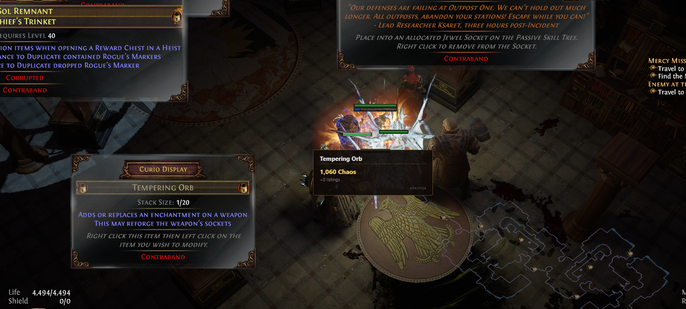
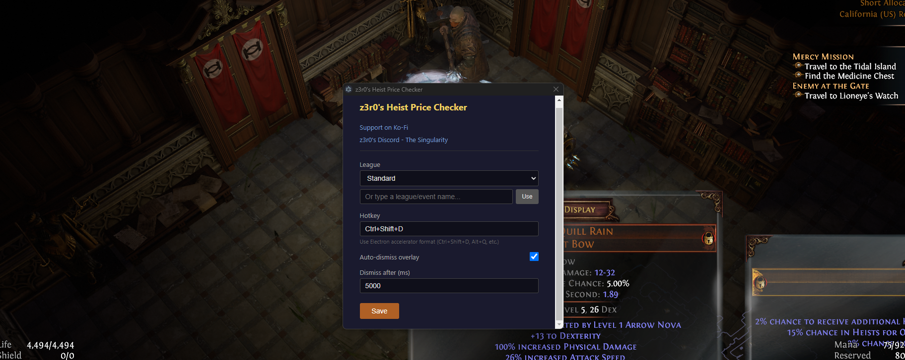

# z3r0's Heist Price Checker

A price checker overlay for Path of Exile Heist curio display items, powered by [poe.ninja](https://poe.ninja).

Standard tools like Awakened PoE Trade don't work on Heist curio displays because items can't be hovered directly. This tool solves that by screenshotting the display, OCR-ing the item name, and showing pricing from poe.ninja in an overlay right on top of PoE.

## Screenshots





## Features

- **Unique items** — detects the unique name and shows the unlinked price from poe.ninja
- **Rare items** — detects the base type and shows a price range (filters out influenced variants)
- **Currency items** — detects currency names and looks up their chaos value
- **Price ranges** — shows min-max chaos values when multiple variants exist
- **Overlay** — appears on top of PoE (windowed fullscreen), auto-dismisses
- **Configurable** — change hotkey, league, dismiss timer via settings

## Installation

### From Release (Recommended)

1. Download the latest `.exe` from the [Releases](https://github.com/z3r0pointflux/heist-price-checker/releases) page
2. Run the installer
3. The app starts in your system tray (bottom-right, near the clock)

### From Source

Requires [Node.js](https://nodejs.org/) (v18+).

```bash
git clone https://github.com/z3r0pointflux/heist-price-checker.git
cd heist-price-checker
npm install
npm start
```

## How to Use

1. **Launch the app** — it runs in the system tray (look for the icon near your clock, you may need to click the ^ arrow to see hidden icons)
2. **Open Path of Exile** in **windowed fullscreen** mode
3. **Enter a Heist** and find a curio display
4. **Hover your cursor** over an item in the curio display
5. **Press Ctrl+Shift+D** (default hotkey) — the price overlay appears near your cursor
6. The overlay auto-dismisses after 5 seconds, or click it to dismiss

## Settings

Left-click the tray icon or right-click and select **Settings** to configure:

| Setting | Description | Default |
|---------|-------------|---------|
| League | The PoE league to check prices for. Pick from the dropdown or type a custom event name. | Standard |
| Hotkey | Key combination to trigger the price check. Uses [Electron accelerator format](https://www.electronjs.org/docs/latest/api/accelerator). | Ctrl+Shift+D |
| Auto-dismiss | Automatically hide the overlay after a timer | On |
| Dismiss timer | How long the overlay stays visible (in milliseconds) | 5000 |

## How It Works

1. **Screenshot** — captures the screen when you press the hotkey (uses PowerShell for reliability)
2. **OCR** — reads item text from the region around your cursor using [Tesseract.js](https://github.com/naptha/tesseract.js)
3. **Item Classification** — fuzzy-matches OCR text against poe.ninja's item database to identify uniques and base types
4. **Price Lookup** — shows price ranges from [poe.ninja](https://poe.ninja), filtering out influenced bases and linked variants (since heist curio items are uninfluenced/unlinked)
5. **Overlay** — displays the result on top of PoE

## Development

### Prerequisites

- [Node.js](https://nodejs.org/) v18 or later
- [Git](https://git-scm.com/)

### Setup

```bash
git clone https://github.com/z3r0pointflux/heist-price-checker.git
cd heist-price-checker
npm install
```

### Running locally

```bash
npm start
```

This compiles TypeScript, copies renderer HTML/CSS to `dist/`, and launches Electron.

### Project structure

```
src/
  main/           # Electron main process
    main.ts        # App entry point, tray, hotkey, overlay logic
    config.ts      # User configuration (hotkey, league, etc.)
    screenshot.ts  # Screen capture via PowerShell
    highlight.ts   # Highlight/region detection
    ocr.ts         # Tesseract.js OCR wrapper
    itemDetect.ts  # Item classification (unique/rare/currency)
    pricing.ts     # poe.ninja API + fuzzy price lookup
    preload.ts     # Electron preload script
  renderer/        # Electron renderer (browser) pages
    overlay.html/css/ts   # Price overlay popup
    settings.html/css/ts  # Settings window
assets/
  tray-icon.png    # Tray icon source
  tray-icon.ico    # Windows tray icon
```

### Debugging

The app writes a log file to your user data directory:

```
%APPDATA%/z3r0s-heist-price-checker/heistchecker.log
```

To find the exact path on your machine, check the app's console output at startup (it logs the path). When reporting issues, please include the contents of this log file.

To run with Electron DevTools for the renderer windows, you can add `win.webContents.openDevTools()` in `main.ts` after creating a window.

### Building for distribution

```bash
npm run build
```

Produces a Windows NSIS installer in `dist/`. The installer allows choosing an install directory and launches the app after installation.

## Troubleshooting

| Problem | Solution |
|---------|----------|
| Tray icon not visible | Click the `^` arrow in the Windows taskbar to see hidden tray icons. You can drag it to the visible area. |
| Hotkey doesn't work in-game | Make sure PoE is running in **Windowed Fullscreen** mode (not exclusive Fullscreen). |
| No price found | The item may not be listed on poe.ninja, or OCR may have misread the name. Check the log file for details. |
| App won't start | Check the log file at `%APPDATA%/z3r0s-heist-price-checker/heistchecker.log` for errors. |

## Support

- [Support on Ko-Fi](https://ko-fi.com/z3r0pointflux)
- [z3r0's Discord - The Singularity](https://discord.gg/YEfUTv58Yg)

## Tech Stack

- Electron + TypeScript
- [Sharp](https://sharp.pixelplumbing.com/) (image processing)
- [Tesseract.js](https://github.com/naptha/tesseract.js) (OCR)
- [Fuse.js](https://www.fusejs.io/) (fuzzy matching)
- [poe.ninja API](https://poe.ninja) (pricing data)

## License

MIT
